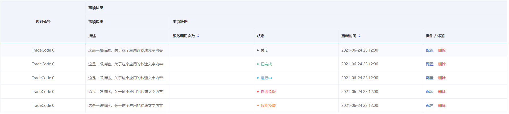

## 数据表格

> 用于展示多条结构类似的数据，可对数据进行排序、筛选、对比或者其它自定义操作，`lookui-table-status` 类名会自动给元素添加上一个 `6 x 6` 圆点 `icon`,并且搭配内置的鹿鸣表格表格常用颜色:
>
> 1. `lookui-status__success`: `#55bf96`
> 2. `lookui-status__process`: `#43bcff`
> 3. `lookui-status__warning`: `#f68d52`
> 4. `lookui-status__danger`:`#ff4d4f`
> 5. `lookui-status__info`: `#000000a6`

#### 基础表格

> 基础的表格展示用法

```vue
<template>
    <el-table class="lookui-table" :data="tableData">
        <el-table-column type="selection" width="55" align="center" />
        <el-table-column prop="id" label="规则编号" />
        <el-table-column prop="descrip" label="描述" />
        <el-table-column
            prop="count"
            label="调用服务次数"
            width="160"
            sortable
        />
        <el-table-column prop="status" label="状态">
            <template slot-scope="scope">
                <div
                    :class="[
                        'lookui-table-status',
                        `${handleStatusClass(scope.row.status)}`
                    ]"
                >
                    {{ scope.row.status | handelStatus }}
                </div>
            </template>
        </el-table-column>
        <el-table-column prop="date" label="更新时间" sortable />
        <el-table-column label="操作 / 标签">
            <template slot-scope="">
                <div class="lookui-table-option">
                    <el-button type="text" class="lookui-status__primary">
                        配置
                    </el-button>
                    <el-button type="text" class="lookui-status__danger">
                        删除
                    </el-button>
                </div>
            </template>
        </el-table-column>
    </el-table>
</template>

<script>
export default {
    filters: {
        handelStatus(status) {
            const _status = {
                0: '已完成',
                1: '进行中',
                2: '超期预警',
                3: '推进缓慢',
                4: '关闭'
            }
            return _status[status]
        }
    },
    data() {
        return {
            tableData: [
                {
                    id: 'TradeCode 0',
                    descrip: '这是一段描述，关于这个应用的秒速文字内容',
                    count: '357 万',
                    status: 4,
                    date: '2021-06-24 23:12:00'
                },
                {
                    id: 'TradeCode 0',
                    descrip: '这是一段描述，关于这个应用的秒速文字内容',
                    count: '358 万',
                    status: 0,
                    date: '2021-06-24 23:12:00'
                },
                {
                    id: 'TradeCode 0',
                    descrip: '这是一段描述，关于这个应用的秒速文字内容',
                    count: '359 万',
                    status: 1,
                    date: '2021-06-24 23:12:00'
                },
                {
                    id: 'TradeCode 0',
                    descrip: '这是一段描述，关于这个应用的秒速文字内容',
                    count: '360 万',
                    status: 3,
                    date: '2021-06-24 23:12:00'
                },
                {
                    id: 'TradeCode 0',
                    descrip: '这是一段描述，关于这个应用的秒速文字内容',
                    count: '361 万',
                    status: 2,
                    date: '2021-06-24 23:12:00'
                }
            ]
        }
    },
    methods: {
        handleStatusClass(status) {
            const _status = {
                0: 'lookui-status__success',
                1: 'lookui-status__process',
                2: 'lookui-status__warning',
                3: 'lookui-status__danger',
                4: 'lookui-status__info'
            }
            return _status[status]
        }
    }
}
</script>
```


#### 带斑马纹表格

> 使用带斑马纹的表格，可以更容易区分出不同行的数据.(选择多行数据时使用 `checkbox`; 对表格进行排序，可快速查找或对比数据。)，`el-table` 组件上的 `stripe` 属性可以创建带斑马纹的表格。它接受一个 `Boolean`，默认为 `false`，设置为 `true` 即为启用。

```vue
<el-table :data="tableData" stripe>
  <!-- ... -->
</el-table>
```


#### 边框表格

> 默认情况下，`el-table` 组件是不具有竖直方向的边框的，如果需要，可以使用 border 属性，它接受一个 Boolean，设置为 true 即可启用。

```vue
<el-table :data="tableData" border>
   <!-- ... -->
</el-table>
```


#### 状态表格

> 可将表格内容 highlight 显示，方便区分「成功、信息、警告、危险」等内容。可以通过指定 `el-talbe` 组件的 `row-class-name` 属性来为 `el-table` 中的某一行添加 `class`，表明该行处于某种状态置常用鹿鸣表格状态颜色:
>
> 1. `lookui-table-status__primary`: `#e1e7ff`
> 2. `lookui-table-status__success`: `#def9f1`
> 3. `lookui-table-status__process`: `#e4f5ff`
> 4. `lookui-table-status__warning`: `#ffede2`
> 5. `lookui-table-status__danger`:`#ffe1e1`
> 6. `lookui-table-status__info`: `#fff9f9`

```vue
<template>
    <el-table
        class="lookui-table"
        :data="tableData"
        :row-class-name="tableRowClassName"
    >
        <el-table-column type="selection" width="55" align="center" />
        <el-table-column prop="id" label="规则编号" />
        <el-table-column prop="descrip" label="描述" />
        <el-table-column
            prop="count"
            label="调用服务次数"
            width="160"
            sortable
        />
        <el-table-column prop="status" label="状态">
            <template slot-scope="scope">
                <div
                    :class="[
                        'lookui-table-status',
                        `${handleStatusClass(scope.row.status)}`
                    ]"
                >
                    {{ scope.row.status | handelStatus }}
                </div>
            </template>
        </el-table-column>
        <el-table-column prop="date" label="更新时间" sortable />
        <el-table-column label="操作 / 标签">
            <template slot-scope="">
                <div class="lookui-table-option">
                    <el-button type="text" class="lookui-status__primary">
                        配置
                    </el-button>
                    <el-button type="text" class="lookui-status__danger">
                        删除
                    </el-button>
                </div>
            </template>
        </el-table-column>
    </el-table>
</template>

<script>
export default {
    filters: {
        handelStatus(status) {
            const _status = {
                0: '已完成',
                1: '进行中',
                2: '超期预警',
                3: '推进缓慢',
                4: '关闭'
            }
            return _status[status]
        }
    },
    data() {
        return {
            tableData: [
                {
                    id: 'TradeCode 0',
                    descrip: '这是一段描述，关于这个应用的秒速文字内容',
                    count: '357 万',
                    status: 4,
                    date: '2021-06-24 23:12:00'
                },
                {
                    id: 'TradeCode 0',
                    descrip: '这是一段描述，关于这个应用的秒速文字内容',
                    count: '358 万',
                    status: 0,
                    date: '2021-06-24 23:12:00'
                },
                {
                    id: 'TradeCode 0',
                    descrip: '这是一段描述，关于这个应用的秒速文字内容',
                    count: '359 万',
                    status: 1,
                    date: '2021-06-24 23:12:00'
                },
                {
                    id: 'TradeCode 0',
                    descrip: '这是一段描述，关于这个应用的秒速文字内容',
                    count: '360 万',
                    status: 3,
                    date: '2021-06-24 23:12:00'
                },
                {
                    id: 'TradeCode 0',
                    descrip: '这是一段描述，关于这个应用的秒速文字内容',
                    count: '361 万',
                    status: 2,
                    date: '2021-06-24 23:12:00'
                }
            ]
        }
    },
    methods: {
        handleStatusClass(status) {
            const _status = {
                0: 'lookui-status__success',
                1: 'lookui-status__process',
                2: 'lookui-status__warning',
                3: 'lookui-status__danger',
                4: 'lookui-status__info'
            }
            return _status[status]
        },
        handleTableStatusClass(status) {
            const _status = {
                0: 'lookui-table-status__success',
                1: 'lookui-table-status__process',
                2: 'lookui-table-status__warning',
                3: 'lookui-table-status__danger',
                4: 'lookui-table-status__info'
            }
            return _status[status]
        },
        tableRowClassName({ row, rowIndex }) {
            return this.handleTableStatusClass(row.status)
        }
    }
}
</script>
```


#### 固定表头

> 纵向内容过多时，可选择固定表头。只要在 `el-table` 组件中定义了 `height` 属性，即可实现固定表头的表格，而不需要额外的代码。

```vue
<el-table class="lookui-table" :data="tableData" border height="300">
  <!-- ... -->
</el-table>
```


#### 固定列

> 横向内容过多时，可选择固定列。固定列需要使用 `fixed` 属性，它接受 `Boolean` 值或者 `left`、 `right`，表示左边固定还是右边固定。

```vue
<template>
    <el-table class="lookui-table" :data="tableData" border>
        <el-table-column
            type="selection"
            width="100"
            align="center"
            fixed="left"
        />
        <el-table-column prop="id" label="规则编号" width="300" />
        <el-table-column prop="descrip" label="描述" width="700" />
        <el-table-column
            prop="count"
            label="调用服务次数"
            width="160"
            sortable
        />
        <el-table-column prop="status" label="状态" width="300">
            <template slot-scope="scope">
                <div
                    :class="[
                        'lookui-table-status',
                        `${handleStatusClass(scope.row.status)}`
                    ]"
                >
                    {{ scope.row.status | handelStatus }}
                </div>
            </template>
        </el-table-column>
        <el-table-column prop="date" label="更新时间" sortable width="300" />
        <el-table-column label="操作 / 标签" fixed="right" width="100">
            <template slot-scope="">
                <div class="lookui-table-option">
                    <el-button type="text" class="lookui-status__primary">
                        配置
                    </el-button>
                    <el-button type="text" class="lookui-status__danger">
                        删除
                    </el-button>
                </div>
            </template>
        </el-table-column>
    </el-table>
</template>

<script>
export default {
    filters: {
        handelStatus(status) {
            const _status = {
                0: '已完成',
                1: '进行中',
                2: '超期预警',
                3: '推进缓慢',
                4: '关闭'
            }
            return _status[status]
        }
    },
    data() {
        return {
            tableData: [
                {
                    id: 'TradeCode 0',
                    descrip: '这是一段描述，关于这个应用的秒速文字内容',
                    count: '357 万',
                    status: 4,
                    date: '2021-06-24 23:12:00'
                },
                {
                    id: 'TradeCode 0',
                    descrip: '这是一段描述，关于这个应用的秒速文字内容',
                    count: '358 万',
                    status: 0,
                    date: '2021-06-24 23:12:00'
                },
                {
                    id: 'TradeCode 0',
                    descrip: '这是一段描述，关于这个应用的秒速文字内容',
                    count: '359 万',
                    status: 1,
                    date: '2021-06-24 23:12:00'
                },
                {
                    id: 'TradeCode 0',
                    descrip: '这是一段描述，关于这个应用的秒速文字内容',
                    count: '360 万',
                    status: 3,
                    date: '2021-06-24 23:12:00'
                },
                {
                    id: 'TradeCode 0',
                    descrip: '这是一段描述，关于这个应用的秒速文字内容',
                    count: '361 万',
                    status: 2,
                    date: '2021-06-24 23:12:00'
                },
                {
                    id: 'TradeCode 0',
                    descrip: '这是一段描述，关于这个应用的秒速文字内容',
                    count: '361 万',
                    status: 2,
                    date: '2021-06-24 23:12:00'
                },
                {
                    id: 'TradeCode 0',
                    descrip: '这是一段描述，关于这个应用的秒速文字内容',
                    count: '361 万',
                    status: 2,
                    date: '2021-06-24 23:12:00'
                }
            ]
        }
    },
    methods: {
        handleStatusClass(status) {
            const _status = {
                0: 'lookui-status__success',
                1: 'lookui-status__process',
                2: 'lookui-status__warning',
                3: 'lookui-status__danger',
                4: 'lookui-status__info'
            }
            return _status[status]
        }
    }
}
</script>
```


#### 固定列和表头

> 横纵内容过多时，可选择固定列和表头。固定列和表头可以同时使用，只需要将上述两个属性分别设置好即可。

```vue
<template>
    <el-table class="lookui-table" :data="tableData" border height="300">
        <el-table-column
            type="selection"
            width="100"
            align="center"
            fixed="left"
        />
        <el-table-column prop="id" label="规则编号" width="300" />
        <el-table-column prop="descrip" label="描述" width="700" />
        <el-table-column
            prop="count"
            label="调用服务次数"
            width="160"
            sortable
        />
        <el-table-column prop="status" label="状态" width="300">
            <template slot-scope="scope">
                <div
                    :class="[
                        'lookui-table-status',
                        `${handleStatusClass(scope.row.status)}`
                    ]"
                >
                    {{ scope.row.status | handelStatus }}
                </div>
            </template>
        </el-table-column>
        <el-table-column prop="date" label="更新时间" sortable width="300" />
        <el-table-column label="操作 / 标签" fixed="right" width="100">
            <template slot-scope="">
                <div class="lookui-table-option">
                    <el-button type="text" class="lookui-status__primary">
                        配置
                    </el-button>
                    <el-button type="text" class="lookui-status__danger">
                        删除
                    </el-button>
                </div>
            </template>
        </el-table-column>
    </el-table>
</template>

<script>
export default {
    filters: {
        handelStatus(status) {
            const _status = {
                0: '已完成',
                1: '进行中',
                2: '超期预警',
                3: '推进缓慢',
                4: '关闭'
            }
            return _status[status]
        }
    },
    data() {
        return {
            tableData: [
                {
                    id: 'TradeCode 0',
                    descrip: '这是一段描述，关于这个应用的秒速文字内容',
                    count: '357 万',
                    status: 4,
                    date: '2021-06-24 23:12:00'
                },
                {
                    id: 'TradeCode 0',
                    descrip: '这是一段描述，关于这个应用的秒速文字内容',
                    count: '358 万',
                    status: 0,
                    date: '2021-06-24 23:12:00'
                },
                {
                    id: 'TradeCode 0',
                    descrip: '这是一段描述，关于这个应用的秒速文字内容',
                    count: '359 万',
                    status: 1,
                    date: '2021-06-24 23:12:00'
                },
                {
                    id: 'TradeCode 0',
                    descrip: '这是一段描述，关于这个应用的秒速文字内容',
                    count: '360 万',
                    status: 3,
                    date: '2021-06-24 23:12:00'
                },
                {
                    id: 'TradeCode 0',
                    descrip: '这是一段描述，关于这个应用的秒速文字内容',
                    count: '361 万',
                    status: 2,
                    date: '2021-06-24 23:12:00'
                },
                {
                    id: 'TradeCode 0',
                    descrip: '这是一段描述，关于这个应用的秒速文字内容',
                    count: '361 万',
                    status: 2,
                    date: '2021-06-24 23:12:00'
                },
                {
                    id: 'TradeCode 0',
                    descrip: '这是一段描述，关于这个应用的秒速文字内容',
                    count: '361 万',
                    status: 2,
                    date: '2021-06-24 23:12:00'
                }
            ]
        }
    },
    methods: {
        handleStatusClass(status) {
            const _status = {
                0: 'lookui-status__success',
                1: 'lookui-status__process',
                2: 'lookui-status__warning',
                3: 'lookui-status__danger',
                4: 'lookui-status__info'
            }
            return _status[status]
        }
    }
}
</script>
```


#### 多级表头

> 数据结构比较复杂的时候，可使用多级表头来展现数据的层次关系。只需要在 `el-table-column` 里面嵌套 `el-table-column`，就可以实现多级表头。

```vue
<template>
    <el-table class="lookui-table" :data="tableData">
        <el-table-column prop="id" label="规则编号" align="center" />
        <el-table-column label="事项信息">
            <el-table-column label="事项说明">
                <el-table-column prop="descrip" label="描述"></el-table-column>
            </el-table-column>
            <el-table-column label="事项数据">
                <el-table-column prpo="count" label="服务调用次数" sortable />
                <el-table-column label="状态">
                    <template slot-scope="scope">
                        <div
                            :class="[
                                'lookui-table-status',
                                `${handleStatusClass(scope.row.status)}`
                            ]"
                        >
                            {{ scope.row.status | handelStatus }}
                        </div>
                    </template>
                </el-table-column>
                <el-table-column prop="date" label="更新时间" sortable />
                <el-table-column label="操作 / 标签">
                    <template slot-scope="">
                        <div class="lookui-table-option">
                            <el-button
                                type="text"
                                class="lookui-status__primary"
                            >
                                配置
                            </el-button>
                            <el-button
                                type="text"
                                class="lookui-status__danger"
                            >
                                删除
                            </el-button>
                        </div>
                    </template>
                </el-table-column>
            </el-table-column>
        </el-table-column>
    </el-table>
</template>

<script>
export default {
    filters: {
        handelStatus(status) {
            const _status = {
                0: '已完成',
                1: '进行中',
                2: '超期预警',
                3: '推进缓慢',
                4: '关闭'
            }
            return _status[status]
        }
    },
    data() {
        return {
            tableData: [
                {
                    id: 'TradeCode 0',
                    descrip: '这是一段描述，关于这个应用的秒速文字内容',
                    count: '357 万',
                    status: 4,
                    date: '2021-06-24 23:12:00'
                },
                {
                    id: 'TradeCode 0',
                    descrip: '这是一段描述，关于这个应用的秒速文字内容',
                    count: '358 万',
                    status: 0,
                    date: '2021-06-24 23:12:00'
                },
                {
                    id: 'TradeCode 0',
                    descrip: '这是一段描述，关于这个应用的秒速文字内容',
                    count: '359 万',
                    status: 1,
                    date: '2021-06-24 23:12:00'
                },
                {
                    id: 'TradeCode 0',
                    descrip: '这是一段描述，关于这个应用的秒速文字内容',
                    count: '360 万',
                    status: 3,
                    date: '2021-06-24 23:12:00'
                },
                {
                    id: 'TradeCode 0',
                    descrip: '这是一段描述，关于这个应用的秒速文字内容',
                    count: '361 万',
                    status: 2,
                    date: '2021-06-24 23:12:00'
                }
            ]
        }
    },
    methods: {
        handleStatusClass(status) {
            const _status = {
                0: 'lookui-status__success',
                1: 'lookui-status__process',
                2: 'lookui-status__warning',
                3: 'lookui-status__danger',
                4: 'lookui-status__info'
            }
            return _status[status]
        }
    }
}
</script>
```



#### 合并行或列

> 多行或多列共用一个数据时，可以合并行或列。通过给 `el-table` 传入 `span-method` 方法可以实现合并行或列，方法的参数是一个对象，里面包含当前行 `row`、当前列 `column`、当前行号`rowIndex`、当前列号 `columnIndex`四个属性。该函数可以返回一个包含两个元素的数组，第一个元素代表 `rowspan`，第二个元素代表 `colspan`。 也可以返回一个键名为 `rowspan` 和 `colspan` 的对象。

##### 合并行

> 返回一个数组

```vue
<template>
    <el-table
        class="lookui-table"
        :data="tableData"
        border
        :span-method="arraySpanMethod"
    >
        <el-table-column prop="id" label="规则编号" />
        <el-table-column prop="descrip" label="描述" />
        <el-table-column
            prop="count"
            label="调用服务次数"
            width="160"
            sortable
        />
        <el-table-column prop="status" label="状态">
            <template slot-scope="scope">
                <div
                    :class="[
                        'lookui-table-status',
                        `${handleStatusClass(scope.row.status)}`
                    ]"
                >
                    {{ scope.row.status | handelStatus }}
                </div>
            </template>
        </el-table-column>
        <el-table-column prop="date" label="更新时间" sortable />
        <el-table-column label="操作 / 标签">
            <template slot-scope="">
                <div class="lookui-table-option">
                    <el-button type="text" class="lookui-status__primary">
                        配置
                    </el-button>
                    <el-button type="text" class="lookui-status__danger">
                        删除
                    </el-button>
                </div>
            </template>
        </el-table-column>
    </el-table>
</template>

<script>
export default {
    filters: {
        handelStatus(status) {
            const _status = {
                0: '已完成',
                1: '进行中',
                2: '超期预警',
                3: '推进缓慢',
                4: '关闭'
            }
            return _status[status]
        }
    },
    data() {
        return {
            tableData: [
                {
                    id: 'TradeCode 0',
                    descrip: '这是一段描述，关于这个应用的秒速文字内容',
                    count: '357 万',
                    status: 4,
                    date: '2021-06-24 23:12:00'
                },
                {
                    id: 'TradeCode 0',
                    descrip: '这是一段描述，关于这个应用的秒速文字内容',
                    count: '358 万',
                    status: 0,
                    date: '2021-06-24 23:12:00'
                },
                {
                    id: 'TradeCode 0',
                    descrip: '这是一段描述，关于这个应用的秒速文字内容',
                    count: '359 万',
                    status: 1,
                    date: '2021-06-24 23:12:00'
                },
                {
                    id: 'TradeCode 0',
                    descrip: '这是一段描述，关于这个应用的秒速文字内容',
                    count: '360 万',
                    status: 3,
                    date: '2021-06-24 23:12:00'
                },
                {
                    id: 'TradeCode 0',
                    descrip: '这是一段描述，关于这个应用的秒速文字内容',
                    count: '361 万',
                    status: 2,
                    date: '2021-06-24 23:12:00'
                }
            ]
        }
    },
    methods: {
        handleStatusClass(status) {
            const _status = {
                0: 'lookui-status__success',
                1: 'lookui-status__process',
                2: 'lookui-status__warning',
                3: 'lookui-status__danger',
                4: 'lookui-status__info'
            }
            return _status[status]
        },
        arraySpanMethod({ row, column, rowIndex, columnIndex }) {
            if (rowIndex % 2 == 0) {
                if (columnIndex === 0) {
                    return [1, 2]
                } else if (columnIndex === 1) {
                    return [0, 0]
                }
            }
        }
    }
}
</script>
```


##### 合并列

> 返回一个对象

```vue
<template>
    <el-table
        class="lookui-table"
        :data="tableData"
        border
        :span-method="objectSpanMethod"
    >
        <el-table-column prop="id" label="规则编号" />
        <el-table-column prop="descrip" label="描述" />
        <el-table-column
            prop="count"
            label="调用服务次数"
            width="160"
            sortable
        />
        <el-table-column prop="status" label="状态">
            <template slot-scope="scope">
                <div
                    :class="[
                        'lookui-table-status',
                        `${handleStatusClass(scope.row.status)}`
                    ]"
                >
                    {{ scope.row.status | handelStatus }}
                </div>
            </template>
        </el-table-column>
        <el-table-column prop="date" label="更新时间" sortable />
        <el-table-column label="操作 / 标签">
            <template slot-scope="">
                <div class="lookui-table-option">
                    <el-button type="text" class="lookui-status__primary">
                        配置
                    </el-button>
                    <el-button type="text" class="lookui-status__danger">
                        删除
                    </el-button>
                </div>
            </template>
        </el-table-column>
    </el-table>
</template>

<script>
export default {
    filters: {
        handelStatus(status) {
            const _status = {
                0: '已完成',
                1: '进行中',
                2: '超期预警',
                3: '推进缓慢',
                4: '关闭'
            }
            return _status[status]
        }
    },
    data() {
        return {
            tableData: [
                {
                    id: 'TradeCode 0',
                    descrip: '这是一段描述，关于这个应用的秒速文字内容',
                    count: '357 万',
                    status: 4,
                    date: '2021-06-24 23:12:00'
                },
                {
                    id: 'TradeCode 0',
                    descrip: '这是一段描述，关于这个应用的秒速文字内容',
                    count: '358 万',
                    status: 0,
                    date: '2021-06-24 23:12:00'
                },
                {
                    id: 'TradeCode 0',
                    descrip: '这是一段描述，关于这个应用的秒速文字内容',
                    count: '359 万',
                    status: 1,
                    date: '2021-06-24 23:12:00'
                },
                {
                    id: 'TradeCode 0',
                    descrip: '这是一段描述，关于这个应用的秒速文字内容',
                    count: '360 万',
                    status: 3,
                    date: '2021-06-24 23:12:00'
                },
                {
                    id: 'TradeCode 0',
                    descrip: '这是一段描述，关于这个应用的秒速文字内容',
                    count: '361 万',
                    status: 2,
                    date: '2021-06-24 23:12:00'
                }
            ]
        }
    },
    methods: {
        handleStatusClass(status) {
            const _status = {
                0: 'lookui-status__success',
                1: 'lookui-status__process',
                2: 'lookui-status__warning',
                3: 'lookui-status__danger',
                4: 'lookui-status__info'
            }
            return _status[status]
        },
        objectSpanMethod({ row, column, rowIndex, columnIndex }) {
            if (columnIndex === 0) {
                if (rowIndex % 2 === 0) {
                    return {
                        rowspan: 2,
                        colspan: 1
                    }
                } else {
                    return {
                        rowspan: 0,
                        colspan: 0
                    }
                }
            }
        }
    }
}
</script>
```

