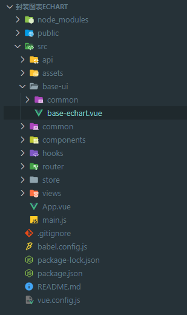
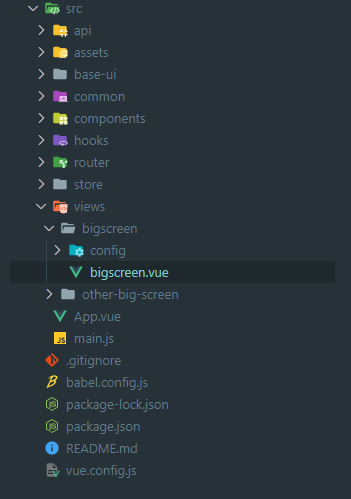
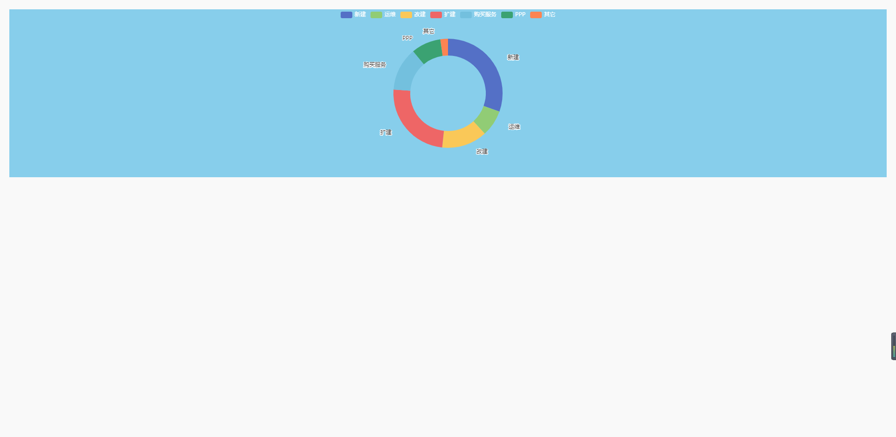
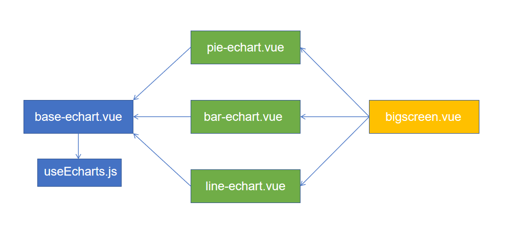

## 介绍

旨在为开发人员快速搭建一个可视化大屏页面，使代码更优雅，更易于维护。

## 封装 base-echart.vue 组件

首先在项目根目录下的`src`文件夹下新建一个`base-ui`文件夹，同时新建一个`common`文件夹和`base-echart.vue`文件。



其中`common`文件夹主要放一些公共的图表组件，比如饼图，柱状图，折线图等(稍后会讲解)

将下图中的代码复制到`base-echart.vue`文件中。

<<< @/docs/.vuepress/components/base-echart.vue

## 添加 useEcharts.js 文件

由于上面 import 了`useEchart`，所以应该添加对应文件。下方为`hooks`文件夹下`useEcharts.js`代码，将其复制到`src/hooks/useEcharts.js`中。

```js
import * as echarts from 'echarts';
export default function (el) {
  // 初始化 echarts
  const echartInstance = echarts.init(el);
  // echarts 的配置方法
  const setOptions = options => {
    echartInstance.setOption(options);
  };
  // 监听页面尺寸变化
  window.addEventListener('resize', () => {
    echartInstance.resize();
  });
  return {
    echartInstance,
    setOptions,
  };
}
```

## 新建 pie-echart.vue 组件(饼图)

在`base-ui/common`下新建一个`pie-echart.vue`组件，将下方代码复制到该组件中。

<<< @/docs/.vuepress/components/pie-echart.vue

其中，`props` 中的`pieData`为对应大屏页面传过来的要展示的数据(后面有讲)，`objV`为对应大屏传过来的配置信息(后面有讲)，
`computed`下的`options`为饼图的默认配置(在不传入`objV`的情况下)。

## 新建一个大屏页面组件

在`views`文件夹下新建一个文件夹(如下图的`bigscreen`)，在该文件夹下新建一个`config`文件夹和对应的`.vue`文件。



将下方代码复制到对应`.vue`文件中(如上图的`bigscreen.vue`)

<<< @/docs/.vuepress/components/big-screen.vue

如想修改图表默认配置，可以在`views/bigscreen/config`文件夹下新建一个`pie1-config.js`配置文件(如果每个类型图表配置需求不一致，可以新建多个配置文件)，将下方代码复制到该文件。
::: tip
配置文件的命名推荐如下形式：图表类型`+`这个图表是第几种配置`+`-config.js。

比如：`pie1-config.js`意思为： 饼图`+`第一种配置的饼图。
:::

```js
export default {
  // 如果对配置项有不理解的地方，可以去 echarts 官网查文档
  tooltip: {
    trigger: 'item',
    formatter: '{b} : {c} ({d}%)',
  },
  legend: {
    left: 'center',
    textStyle: {
      color: '#fff',
    },
  },
  series: [
    {
      type: 'pie',
      radius: ['45%', '65%'],
      center: ['50%', '50%'],
      roseType: '',
      label: {
        show: true,
      },
      labelLine: {
        show: false,
      },
    },
  ],
};
```

这样，就生成了一个简单的大屏页面(虽然看起来很丑，但是基本原理就是这样)! 之后再往上添加其他组件就行了。


## 各组件的关系图

首先在`base-echart.vue`中引入`useEcharts.js`，然后`pie-echart.vue(饼图)`，`bar-echart.vue(柱图)`，`line-echart.vue(折线图)`又依赖`base-echart.vue`，`bigscreen.vue`又依赖各种图表组件。


这样层层封装后，只需要传入对应配置和数据即可，以后开发一个页面将会变得非常快！
