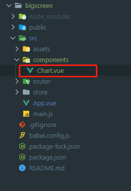
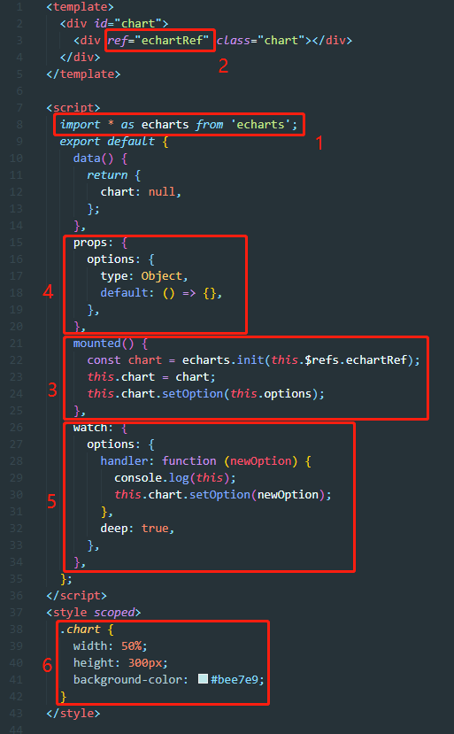
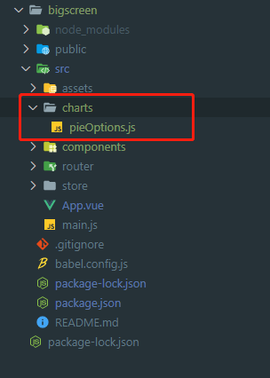
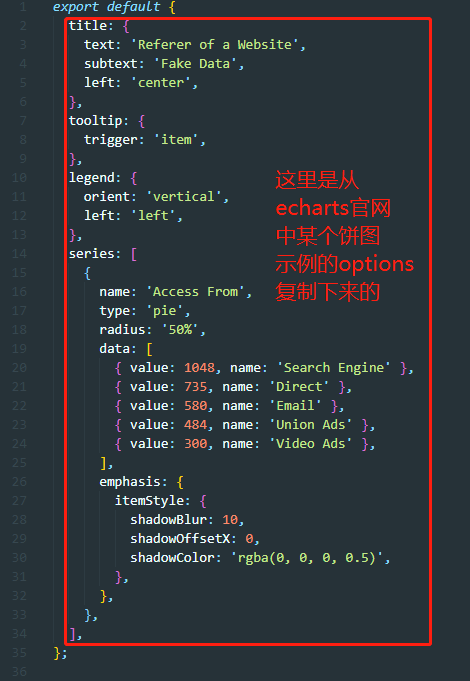
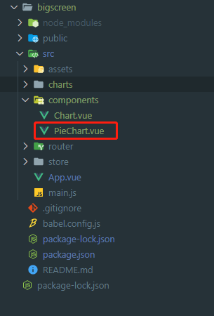
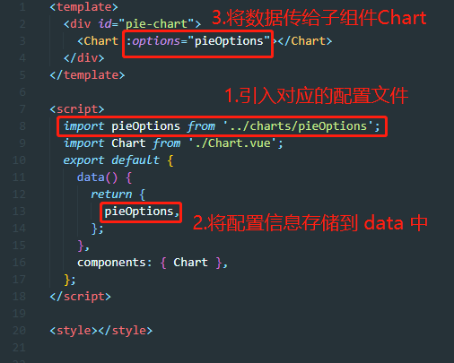
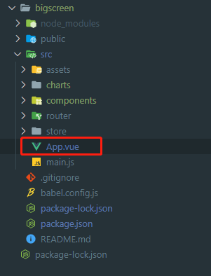
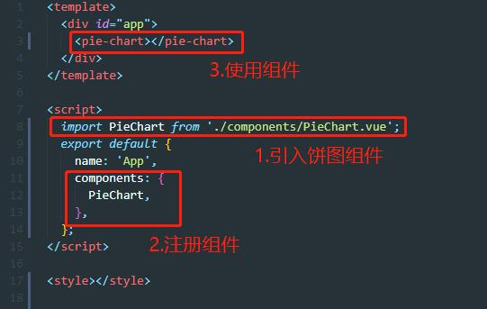
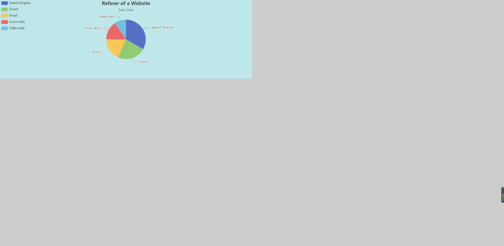
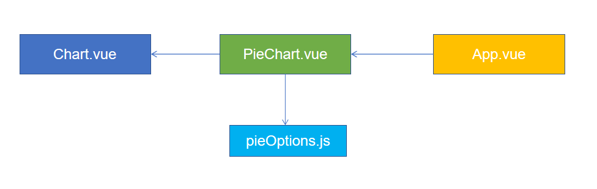

## 介绍

旨在为开发人员快速搭建一个可视化大屏页面，通过封装以及配置的方式更快生成一个大屏页面，使代码更优雅，更易于维护。

## 安装 echarts 依赖

先 cd 到你的项目下，然后在终端输入以下代码，安装相关依赖。

- npm 安装

```sh
npm install echarts
```

- yarn 安装

```sh
yarn add echarts
```

## 新建基础组件

下图是一个最基本的 vue 的目录结构，在项目根目录下的 src/components 中新建一个 Chart.vue 组件。



该组件的作用是加载并初始化 echarts 容器，并根据配置的变化更新图表。

下图为 Chart.vue 组件中的配置：



上图中的代码都表示什么意思呢？

> 1. 首先，为了能使用 echarts，我们需要先 import 它；

> 2. echarts 官网中规定，要想使 echart 生效，需要一个 dom 元素作为容器并调用它的 init 方法才能进行初始化，那么在 vue 中要想获取 dom 元素就必须给对应标签中添加 ref 属性；

> 3. ref 中保存的元素需要在 dom 加载完成后才会有值，所以可以在 mounted 生命周期中获取；

> 4. 接着创建一个 props 属性 options，该属性用来接收父组件传过来的配置；

> 5. 这时，虽然 Chart.vue 组件能用了，但是当 options(这里的 options 相当于后端传过来的数据)发生变化时，图表不会跟着刷新，为了让图表实时刷新，可以使用 vue 中的 watch；

> 6. echarts 官网规定 echarts 容器必须加宽高，否则不能正常显示图表。

## 新建饼图配置文件

::: tip 提示
以下内容都以饼图为例进行讲解，掌握后，使用者可以自行添加其他类型的图表组件。
:::

完成上一步后，假设现在需要在页面展示一个饼图，可以按照以下步骤来做：

在 src 下新建一个 charts 文件夹，然后在该文件夹下新建一个 pieOptions.js 文件，然后去 echarts 官网，找一个饼图的配置，并把配置粘贴上去，如下图所示：



下图是 pieOptions.js 中的内容：



## 新建一个饼图组件

接着，以饼图为例，在 src/components 下新建一个 PieChart.vue 组件，创建此组件的目的是为了复用，以后遇到生成饼图的需求，都可以直接调用此组件。



下图为 PieChart.vue 组件对应内容：



## 在 App.vue 中使用

最后，我们在 App.vue 中引用刚刚创建好的饼图组件就可以了，代码如下：

App.vue 的位置：



App.vue 中的代码：



执行 npm run serve 或者 yarn serve （取决于你的 package.json 中定义的脚本是什么）运行代码，至此，一个简单的页面就完成了，效果如下图：



::: tip
为了演示效果，我给页面背景加了灰色，实际开发中根据需求来配置就行。
:::

## 各组件关系图

为了便于大家理解，我画了上面出现的几个组件的关系图，大家可以对照这个图再梳理一遍他们之间的关系，首先 App.vue 引用了 PieChart.vue，然后 PieChart.vue 又引用了 Chart.vue 和 pieOptions.js。



## 总结

最后，也许你会问，这样封装好麻烦，我可不可以直接在 PieChart.vue 写所有逻辑，然后让直接让 App.vue 使用不就行了吗？

当然可以，但是一旦将所有逻辑全部写在一个组件中，那么代码将变得非常臃肿，并且难以维护，试想一下如果直接把初始化 echarts 的逻辑以及各个图表的配置文件全部放在一个文件中，然后这时出现了一个新需求：往页面中加一个柱状图，那势必会有很多重复的代码。总之，希望大家都能掌握封装的思想!
